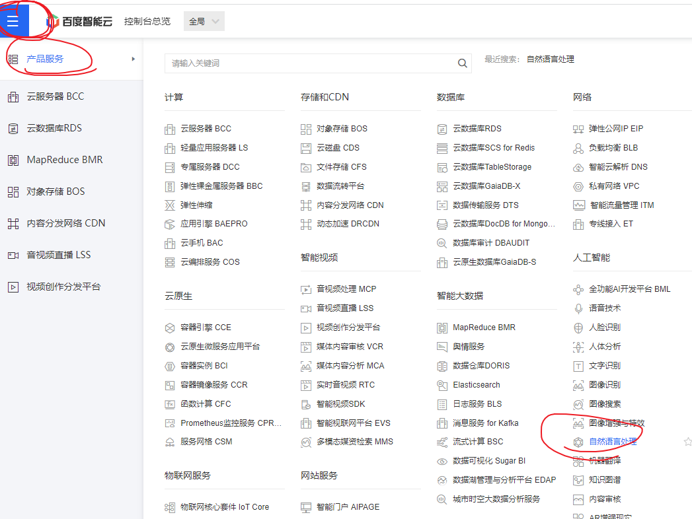
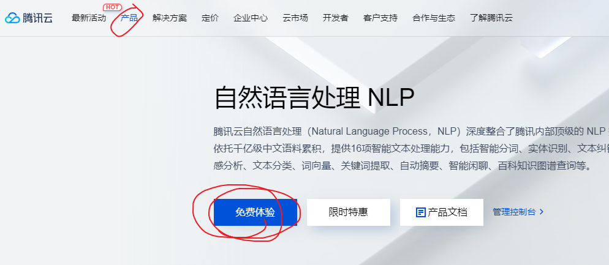
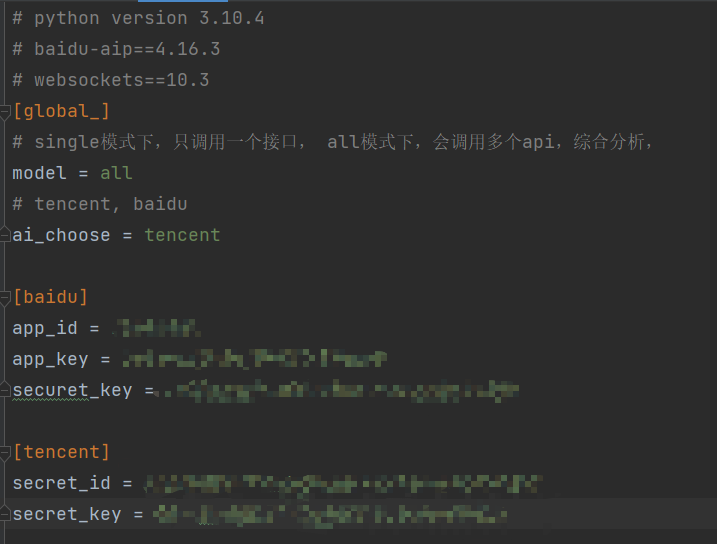
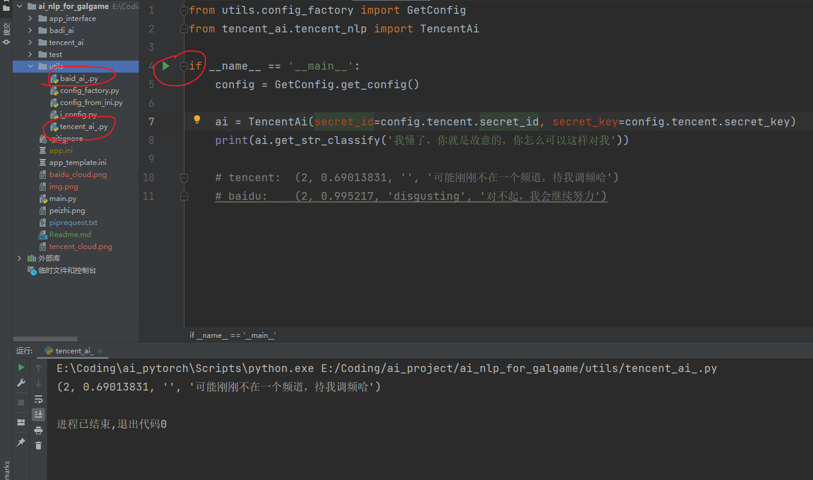

# 概述

## 目的

- 起因是看到B站独立游戏开发者的一个视频，有好玩的相亲游戏创意
- 但是因为客观需要百万级别文案工作量而不得不一直延期
- 于是想到ai能为galgame做些什么

## 工程说明
> [c#测试工程](https://gitee.com/liuliuliuweixing/websocket-test.git)
> 如果不想看我啰嗦，可以直接下跳到工程启动与交互

- 集成了百度和腾讯的nlp - sdk接口
- 采用本地websocket 和c#通信

#### Q:为什么使用python，而不用c#的SDK
#### A:以下几点考虑

- 目前有些ai服务商未提供pc端，依据设备授权，如果将一些获取接口的关键id,key信息放在终端会有很大的泄漏风险
> 别人通过一些逆向手段得到你的接口调用id,key,secret_key就可以无限制调用接口，这些费用都将由你承受

- python可以很方便的转移到服务端，如果真的需要可以自己做设备管理，授权的功能，当然对于一些小微开发而言是一个额外且非必要的开销
- python是人工智能开发的主力语言，如果对于ai服务商提供的nlp接口感到不满又确实有能力，可以自己训练ai，并且根据此工程扩展
- python可以便利的开发爬虫，在github上我看大有关artbreeder的相关爬虫，可以再结合paddle(飞浆)做出一些动态的头像
- 以上种种是使用python开发，并使用websocket和c#进行通信的理由

## 使用方法的一些构想

- 假定玩家和游戏角色进行互动，从好感度1-100中会经历多段对话
- 让我们设置关键的好感节点1, 20, 60, 80, 100，在关键节点使用传统方式构建精细的剧情文案，节点之外的剧情文案交由ai来应答
> 主要用到情感倾向判断    
  - 判定玩家输入的__文本__的情感倾向(积极-消极)
    - 根据情感倾向(积极-消极)对应的增加游戏角色的好感度
        - 因为目前市面上较为成熟的ai，回答都是比较保守比较怂的，所以可以视情况而定是否采纳，如果是一般对话我认为也足够了
        - 情感分类ai服务商几乎都提供了，区别是对积极和消极程度判定有所不同
  
    - 给玩家输入反馈
      - 主要用到chat_robot(闲聊)，我先后调研了多个渠道，多种方式，碍于自己菜，暂时没法针对性的训练答复，所以采取了折中的方案，使用第三方ai服务商
      - 关于答复目前工程里的baidu_ai是不稳定的，不一定会有，因为调用的是百度nlp中的对话情感倾向分析，但是它有一个好的地方是会返回话语的情绪标签
      - 例如对ai输入"滚呐，别让我在看见你"，得到的除了消极的倾向判断还有label，angry，这也是我最后决定集成它的原因
      - 关于对话回复的主力是tencent chat_robt，问一句答一句，至于效果就像我之前说的，可以用来应付一些不重要的对话
  
## 工程启动与交互

#### 确保你有这些环境
> 如果你需要帮助请给我发邮件 __2276959997@qq.com__

- 一些关于python的基础
- python 3.10.4，如果你想要详细了解本工程，建议下载pycharm社区版(免费的)
- git clone本工程
- 其他的依赖库在piprequest.txt，其中tencent的sdk比较大，下起来会慢一些
```
pip intall -r piprequest.txt
```
- 去ai服务商注册账号，申请，并开通授权，这里需要一点耐心去申请
- 
- 
> 百度的ai比较好集成，腾讯的我看起来差点懵逼了，不信你们可以自己去康康
- 将根目录下的app_template.ini改名为app.ini，并将申请好的key配置进去
- 
- 如果你想单独测试ai的效果，可以cd到utils文件夹下，里面有baidu_ai_.py和tecent_ai_.py可以单独测试
- 
- 最后测试都可以后，可以启动工程了,cd到项目根目录，命令行输入: python main.py
- 如果你觉得这个工程对你有帮助，请star，start过200会继续集成阿里api

## 之后的集成计划

- 集成ailicloud-nlp
- 集成artbreeder爬虫，实现人脸图像自由
- 用paddle+arbreeder，动态人脸图像自由
> 合成效果 __在res/merge.mp4__
- 训练针对性较强的回复
  - 根据游戏角色的好感度对玩家凡尔赛式回复，刻薄式回复，古风式回复，琼瑶式回复等等
  - 只有到这一步获取ai才能让游戏角色更加鲜活起来

 
